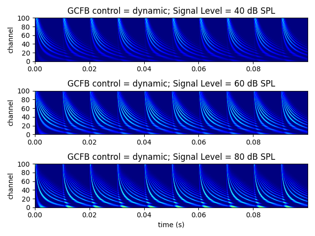
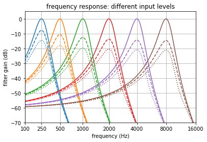
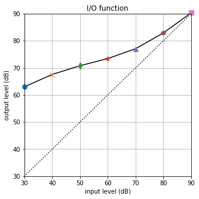

# GammachirPy

A Python package of the dynamic compressive gammachirp filterbank

<!--  -->


## What is the Dynamic Compressive Gammachirp Filterbank

- [The dynamic compressive gammachirp filterbank (dcGC-FB)](https://ieeexplore.ieee.org/document/1709909) is a time-domain, nonlinear and level-dependent auditory filterbank that has a fast-acting level control circuit.



- The dcGC-FB can represent:
  - level-dependent and asymmetric auditory filter shape
  - fast compression (cochlear amplifier)
  - two-tone supression.




- It was demonstrated that the original gammachirp filter (the static version of the dcGC-FB) explains a notched-noise masking data well for normal hearing and hearing impaired listeners.
  
- The original MATLAB packages of the gammachirp filterbank are [HERE](https://github.com/AMLAB-Wakayama/gammachirp-filterbank).

## About GammachirPy Project

- The project name, "GammachirPy (がんまちゃーぴー)" is "Gammachirp + Python".

- This project aims to translate the original MATLAB codes to Python and share them as open-souce software.
  
- In addition, I would like to add some demo scripts of the Jupyter Notebook for educational uses.

## Reproducibility

- To compare outputs of the GammachirPy and the original dcGC-FB, I'm using a simple pulse train as an input signal with some sound pressure levels (SPLs).
  


- In the latest version of **gcfb_v211**, the root-mean-squared error (RMSE) in each level is:

    | SPL (dB) | 40 | 60 | 80 |
    | --- | --- | --- | --- |
    | RMSE    | 4.11e-14 | 2.26e-13 | 1.75e-12 |

- There are still some errors between the GammachirPy and the original dcGC-FB, but the errors are minimal. I would like to improve them in the future:-)
  
## Requirements

- Python >= 3.9.1
- NumPy >= 1.23.1
- SciPy >= 1.8.1
- Matplotlib >= 3.5.2
- Jupyter >= 1.0.0

Please see more information in requirements.txt.

## Installation

    git clone https://github.com/kyama0321/gammachirpy
    cd gammachirpy

    # If you use "venv"
    python3 -m venv venv
    . venv/bin/activate
    pip install -r requirements.txt

## Repository Structure

- The directory structure is almost the same as the original MATLAB page, and this repository will contain different versions in the future.
  - **gcfb_v211**: sample-by-sample processing version
  - **gcfb_v221 (T.B.D.)**: frame-basd processing
  - **gcfb_v233 (T.B.D.)**: new schemes for Wadai Hearing Impaired Simulator (WHIS)

- In each version, the directory mainly contains:
  - **gammachirp.py**: passive gammachirp (pGC) filter
  - **gcfb_v\*.py**: dynamic compressive gammachirp (dcGC) filter
  - **utils.py**: useful functions for auditory signal processing
  - **test_gcfb_v\*_{pulse/speech}.py**: test codes to check
  - **demo_gammachirp.ipynb**: demo scripts for educational uses of the dcGC-FB on the Jupyter Notebook
  - **demo_gcfb_v\*_{pulse/speech}.py**: demo spripts for practical uses on the Jupyter Notebook. The scripts are based on test_gcfb_v*_{pulse/speech}.py.

## Getting Started

The following guide is based on **gcfb_v211/demo_gcfb_v211_speech.ipynb**.

1. Import packages.
   
    ```Python
    import numpy as np

    import utils
    import gcfb_v211 as gcfb
    ```
   
2. Set default parameters for the gammachirp filterbank as a class variables. Note that if you don't set any parameters, **gcfb.dcgc_v\*()** automaticaly set a default paramters determined in **gcfb.set_param()**

    ```python
    class GCparamDefault:
          fs = 48000 # sampling frequency
          num_ch = 100 # number of channels
          f_range = np.array([100, 6000]) # range of center frequencies
          out_mid_crct = 'ELC' # equal loudness contour (ELC)
          ctrl = 'dynamic' # time-varying
    ```

3. Read an audio sound and normalize the signal's amplitude (-1 ~ +1). I recomend to use **utils.audioread()**. Note that the recommended sampling frequency of the input sound is 48,000 Hz.

    ```python
    # read the sample speech
    path_file = './sample/snd_gammachirpy.wav'
    snd, fs = utils.audioread(path_file)
    ```

4. Adjust the input signal level as a sound pressure level (SPL) by **utils.eqlz2meddis_hc_level()**.

    ```python
    # sound pressure level (SPL)
    dbspl = 40
    # Level equalization
    snd_eq, _ = utils.eqlz2meddis_hc_level(snd, dbspl)
    ```

5. Analyze the input signal by **gcfb.gcfb_v\*()** with default parameters.

    ```python
    # GCFB
    gc_param = GCparamDefault()
    cgc_out, pgc_out, _, _ = gcfb.gcfb_v211(snd_eq, gc_param)
    ```

6. You can get the output signal (num_ch $\times$ len(snd)) as :
   - **cgc_out**: outputs of the dynamic "compressive" gammachirp filterbank (dependent on the input signal level)
   - **pgc_out**: outputs of the "passive" gammachirp filterbank (not dependent on the input signal level)

## Acknowledgements

The packages is inspired by [gammachirp filterbank](https://github.com/AMLAB-Wakayama/gammachirp-filterbank) by Prof. Toshio Irino.

## References

- [Toshio Irino and Roy D. Patterson "A time-domain, level-dependent auditory filter: the gammachirp," J. Acoust. Soc. Am., 101 (1), pp.412-419, January 1997.](https://doi.org/10.1121/1.417975)
- [Toshio Irino and Roy D. Patterson, "A compressive gammachirp auditory filter for both physiological and psychophysical data," J. Acoust. Soc. Am., 109 (5), pp.2008-2022, May 2001.](https://doi.org/10.1121/1.1367253)
- [Roy D. Patterson, Masashi Unoki, and Toshio Irino "Extending the domain of center frequencies for the compressive gammachirp auditory filter," J. Acoust. Soc. Am., 114 (3), pp.1529-1542, Sept 2003.](https://doi.org/10.1121/1.1600720)
- [Toshio Irino and Roy D. Patterson, "A dynamic compressive gammachirp auditory filterbank" IEEE Trans. Audio, Speech, and Language Process., 14(6), pp.2222-2232, Nov. 2006.](https://doi.org/10.1109/TASL.2006.874669)
- [Toshio Irino, "An introduction to auditory filter," J. Acoust. Soc. Jpn., Vol.66, No.10, pp.505-512, 2010. (in Japanese)](https://doi.org/10.20697/jasj.66.10_506)
