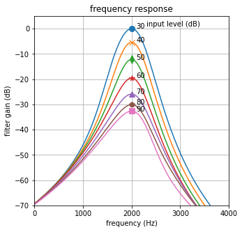

# GammachirPy

A python version of the dynamic compressive gammachirp filterbank

## What is the Dynamic Compressive Gammachirp Filterbank

- The dynamic compressive gammachirp filterbank (dcGC-FB) is a nonlinear and level-dependent auditory filterbank that has a fast-acting level control circuit.

- The dcGC-FB can represent:
  - level-dependent and asymmetric auditory filter shape
  - fast compression (cochlear amplifier)
  - two-tone supression.

- It was demonstrated that the original gammachirp filter (the static version of the dcGC-FB) explains a notched-noise masking data well for normal hearing and hearing impaired listeners.
  
- The original MATLAB packages are here: https://github.com/AMLAB-Wakayama/gammachirp-filterbank

## About GammachirPy Project

- The project name, "GammachirPy (がんまちゃーぴー)" is "Gammachirp + Python".

- This project aims to translate the original MATLAB codes to Python and share them as open-souce software.
  
- In addition, I would like to add some demo scripts of the Jupyter Notebook for educational uses.

## Reproducibility

- To compare outputs of the GammachirPy and the original dcGC-FB, I'm using a simple pulse train as an input signal with some sound pressure levels (SPLs).
  

- In the current version, the root-mean-squared error (RMSE) in each level is:

    | SPL (dB) | 40 | 60 | 80 |
    | --- | --- | --- | --- |
    | RMSE    | 4.11e-14 | 2.26e-13 | 1.75e-12 |

- There are still some errors between the GammachirPy and the original dcGC-FB, but the errors are minimal. I would like to improve them in the future:-)

## Repository Structure

- The directory structure is almost the same as the original MATLAB page, and this repository will contain different versions in the future.
  - GCFBv211pack: sample-by-sample processing version
  - GCFBv221pack: frame-basd processing (a future plan)
  - GCFBv233: new schemes for WHIS (a future plan)

- In each version, the directory mainly contains:
  - gammachirp.py: passive gammachirp (pGC) filter
  - gcfb_v*.py: dynamic compressive gammachirp (dcGC) filter
  - utils.py: useful functions for auditory signal processing
  - test_gcfb_v*_{pulse/speech}.py: test codes to check
  - demo_{gammachirp/gcfb_v*}.ipynb: demo scripts on the Jupyter Notebook

## Requirements

- Python >= 3.9

## Installation

    git clone https://github.com/kyama0321/GammachirPy
    cd GammachirPy

## Acknowledgements

The packages is inspired by gammachirp filterbank (https://github.com/AMLAB-Wakayama/gammachirp-filterbank) by Prof. Toshio Irino.

## References

- Irino,T. and Patterson,R.D.: JASA, Vol.101, pp.412-419, 1997.  
- Irino,T. and Patterson,R.D.: JASA, Vol.109, pp.2008-2022, 2001.
- Patterson,R.D., Unoki,M. and Irino,T.: JASA, Vol.114, pp.1529-1542, 2003.
- Irino,T. and Patterson,R.D.: IEEE Trans.ASLP, Vol.14, pp.2222-2232, 2006.
- Irino, T.: ASJ, Vol.66, No.10, pp.505-512, 2010. (in Japanese)
https://doi.org/10.20697/jasj.66.10_506